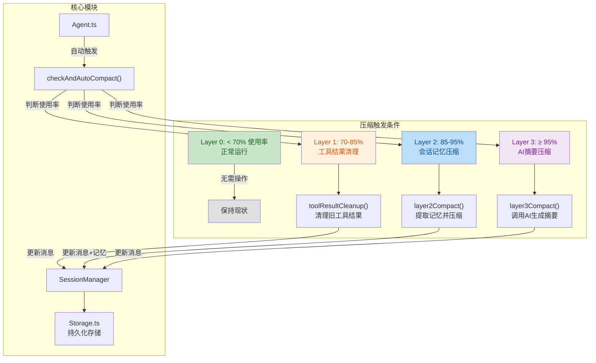
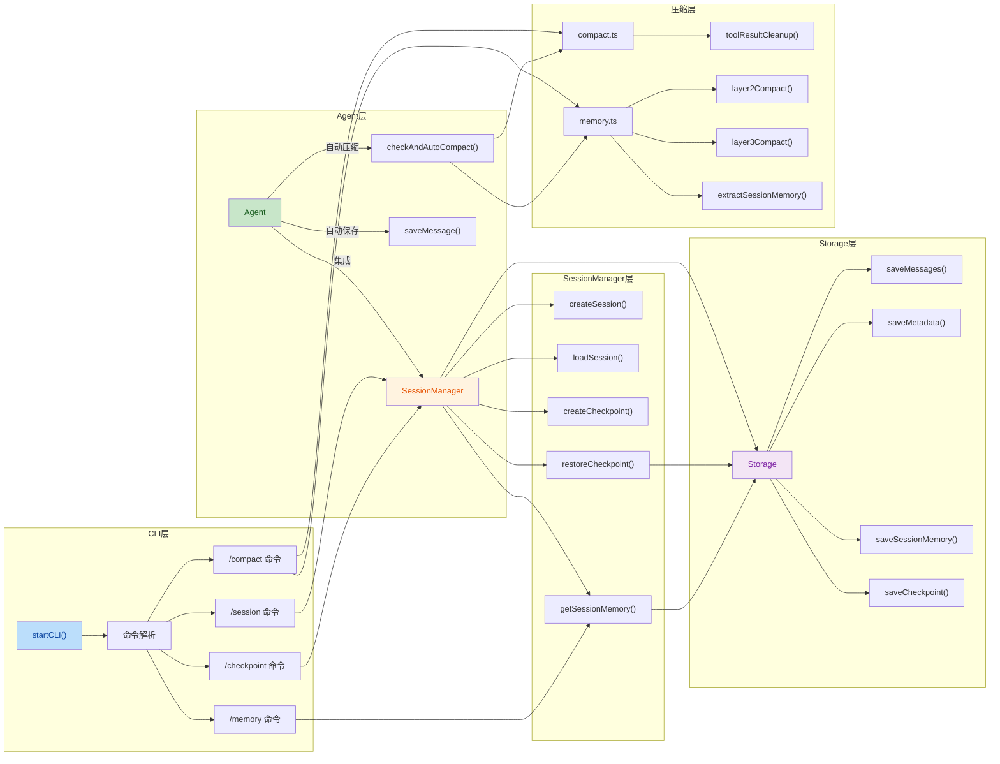

## 1. 高层摘要 (TL;DR)

*   **影响范围:** 🔴 **高** - 重构核心架构,新增完整的会话管理和智能记忆系统
*   **关键变更:**
    *   ✨ 新增**四层压缩架构** (Layer 0-3) 智能管理上下文
    *   📦 实现**会话持久化**系统,支持多会话管理和检查点回溯
    *   🧠 引入**智能记忆提取**,自动记录项目概要、任务、决策和问题解决方案
    *   🎛️ 扩展CLI命令集,新增 `/memory`、`/compact`、`/session`、`/checkpoint` 等命令
    *   🔧 Agent集成自动保存和自动压缩机制

---

## 2. 可视化架构图

### 2.1 四层压缩架构流程



### 2.2 会话管理与记忆系统架构



---

## 3. 详细变更分析

### 3.1 核心模块新增

#### 📦 **SessionManager** (`src/core/session-manager.ts`)
**功能:** 会话生命周期管理中枢

| 方法 | 功能 | 说明 |
|------|------|------|
| `createSession()` | 创建新会话 | 生成UUID,初始化元数据和存储 |
| `loadSession()` | 加载会话 | 从存储恢复消息、记忆和检查点 |
| `saveSession()` | 保存会话 | 更新元数据、消息和索引 |
| `createCheckpoint()` | 创建检查点 | 保存当前状态快照 |
| `restoreCheckpoint()` | 恢复检查点 | 回滚到指定检查点状态 |
| `getSessionMemory()` | 获取记忆 | 返回会话记忆对象 |
| `updateSessionMemory()` | 更新记忆 | 增量更新记忆字段 |

**关键逻辑:**
```typescript
// 检查点创建示例
createCheckpoint(description?: string, type: 'auto' | 'manual' | 'before_compact') {
  const checkpoint: Checkpoint = {
    id: uuidv4(),
    timestamp: new Date().toISOString(),
    messageIndex: this.messages.length,
    description,
    tokenCount: this.getTokenCount(),
    type,
  };
  this.storage.saveCheckpoint(this.currentSessionId, checkpoint, this.messages);
  return checkpoint;
}
```

#### 💾 **Storage** (`src/core/storage.ts`)
**功能:** 文件系统持久化层

**存储结构:**
```
~/.notclaudecode/
├── index.json              # 会话索引
├── config.json             # 配置文件
└── sessions/
    └── {sessionId}/
        ├── metadata.json   # 会话元数据
        ├── messages.jsonl  # 消息记录(逐行追加)
        ├── session_memory.json  # 记忆数据
        ├── session_memory.md    # 记忆Markdown
        └── checkpoints/
            ├── {checkpointId}.json
            └── {checkpointId}_messages.json
```

**关键方法:**
- `appendMessage()` - 使用JSONL格式逐行追加,避免大文件重写
- `loadIndex()` / `saveIndex()` - 维护会话索引,支持快速查询
- `generateMemoryMarkdown()` - 生成可读性强的记忆文档

#### 🗜️ **Compact** (`src/core/compact.ts`)
**功能:** Layer 1 压缩 - 工具结果清理

| 函数 | 触发条件 | 压缩策略 |
|------|----------|----------|
| `toolResultCleanup()` | Token使用率 ≥ 70% | 清理旧工具结果,保留最近5个 |
| `shouldTriggerToolResultCleanup()` | 检查是否需要压缩 | 基于阈值判断 |
| `getToolResultStats()` | 统计分析 | 返回工具结果数量、Token统计 |
| `estimateCompactSavings()` | 预估效果 | 估算可节省的Token数 |

**压缩策略:**
```typescript
// 保留最近N个工具结果
const keepRecent = config.toolResultKeepRecent; // 默认5
const toolResultsToClean = toolResults.slice(0, -keepRecent);

// 截断长输出
function truncateOutput(output: string, maxLines: number = 10): string {
  // 保留前半部分 + ... + 后半部分
}
```

#### 🧠 **Memory** (`src/core/memory.ts`)
**功能:** Layer 2/3 压缩 - 记忆提取与AI摘要

**Layer 2 - 会话记忆压缩:**
```typescript
function extractSessionMemory(messages: Message[]): SessionMemory {
  return {
    projectOverview: "从第一条用户消息提取",
    completedTasks: "识别'完成'、'done'等关键词",
    keyDecisions: "识别'决定'、'选择'等关键词",
    currentState: "从最近助手消息提取",
    importantFiles: "正则匹配文件路径",
    problemsAndSolutions: "识别'错误'、'问题'、'fix'等",
  };
}
```

**Layer 3 - AI摘要压缩:**
```typescript
async function layer3Compact(messages, provider, contextLimit, keepRecentCount) {
  // 1. 调用AI生成摘要
  const summary = await provider.chat([summaryPrompt], []);
  
  // 2. 替换历史消息为摘要
  const compactedMessages = [
    ...systemMessages,
    { role: 'user', content: `[Previous Summary]\n${summary}` },
    ...recentMessages,
  ];
  
  return { messages: compactedMessages, summary, tokensSaved };
}
```

#### 📊 **Token Counter** (`src/utils/token-counter.ts`)
**功能:** 精确Token计数与上下文管理

| 函数 | 功能 | 算法 |
|------|------|------|
| `estimateTokens()` | 估算Token数 | 中文: /1.5, 其他: /4 |
| `countMessageTokens()` | 单消息计数 | content + tool_calls + name + 4 |
| `getModelContextLimit()` | 获取模型限制 | 查表返回各模型上下文大小 |

**支持的模型上下文限制:**
| 模型 | 上下文限制 |
|------|------------|
| gpt-4-turbo | 128,000 |
| deepseek-chat | 64,000 |
| glm-4 | 128,000 |
| qwen-plus | 32,768 |
| moonshot-v1-128k | 128,000 |

#### 📝 **类型定义** (`src/types/session.ts`)
**新增接口:**

| 接口 | 用途 |
|------|------|
| `SessionMetadata` | 会话元数据(ID、时间、模型、状态等) |
| `Checkpoint` | 检查点(ID、时间戳、消息索引、描述) |
| `SessionMemory` | 会话记忆(项目概要、任务、决策、文件等) |
| `CompactConfig` | 压缩配置(阈值、保留数量等) |

**默认配置:**
```typescript
DEFAULT_COMPACT_CONFIG = {
  toolResultThreshold: 15,        // 工具结果数量阈值
  toolResultKeepRecent: 5,         // 保留最近5个
  sessionMemoryThreshold: 0.8,     // 80%触发Layer 2
  fullCompactThreshold: 0.95,       // 95%触发Layer 3
  minTokensToKeep: 10000,
  minMessagesToKeep: 10,
};
```

---

### 3.2 Agent改造 (`src/core/agent.ts`)

**变更点:**

| 变更类型 | 说明 |
|----------|------|
| 构造函数增强 | 新增 `sessionManager` 和 `autoSave` 参数 |
| 自动保存 | 每条消息通过 `saveMessage()` 自动追加到存储 |
| 自动压缩 | 实现 `checkAndAutoCompact()` 和 `checkAndAutoCompactAsync()` |
| 上下文统计 | 使用精确的 `countMessageTokens()` 替代简单估算 |

**自动压缩逻辑:**
```typescript
checkAndAutoCompact() {
  const usagePercent = this.getContextUsagePercent() / 100;
  
  if (usagePercent >= 0.7) {
    // Layer 1: 工具结果清理
    const result = toolResultCleanup(this.messages, contextLimit, 0.6);
    if (result.triggered) {
      this.messages = result.messages;
      this.sessionManager.setMessages(result.messages);
      return { triggered: true, reason: 'Layer 1 compact' };
    }
  }
  
  if (usagePercent >= 0.85) {
    // Layer 2: 会话记忆压缩
    const memory = this.sessionManager.getSessionMemory();
    const result = layer2Compact(this.messages, contextLimit, memory);
    this.messages = result.messages;
    this.sessionManager.setSessionMemory(result.memory);
    return { triggered: true, reason: 'Layer 2 compact' };
  }
  
  return { triggered: false };
}
```

---

### 3.3 CLI命令扩展 (`src/cli/index.ts`)

**新增命令列表:**

| 命令 | 功能 | 示例 |
|------|------|------|
| `/memory` | 显示会话记忆摘要 | `/memory` |
| `/compact` | 手动触发压缩 | `/compact` |
| `/session` | 显示当前会话信息 | `/session` |
| `/session new` | 创建新会话 | `/session new -n "项目A"` |
| `/session list` | 列出所有会话 | `/session list` |
| `/session switch` | 切换会话 | `/session switch` |
| `/session delete` | 删除会话 | `/session delete` |
| `/session title <name>` | 设置会话标题 | `/session title "Bug修复"` |
| `/checkpoint` | 创建检查点 | `/checkpoint -n "修复前"` |
| `/checkpoint list` | 列出检查点 | `/checkpoint list` |
| `/checkpoint <id>` | 恢复检查点 | `/checkpoint abc123` |
| `/checkpoint delete` | 删除检查点 | `/checkpoint delete` |

**会话恢复流程:**
```typescript
// 启动时自动检测上次会话
const lastSession = storage.getLastActiveSession();
if (lastSession) {
  const { resume } = await inquirer.prompt([
    { type: 'confirm', message: 'Resume this session?', default: true }
  ]);
  if (resume) {
    await sessionManager.loadSession(lastSession);
  }
}
```

---

### 3.4 文档更新 (`README.md`)

**新增章节:**

| 章节 | 内容 |
|------|------|
| 🧠 智能记忆系统 | 会话持久化、四层压缩、检查点、多会话管理 |
| 🗜️ 四层压缩架构 | Layer 0-3 的触发条件和压缩策略 |
| 命令列表 | 新增记忆、压缩、会话、检查点相关命令 |
| 项目结构 | 新增 `session-manager.ts`、`storage.ts`、`compact.ts`、`memory.ts` |
| TODO | 近期/中期/长期计划和已知问题 |

---

### 3.5 测试文件 (`tests/memory-system-test.ts`)

**测试用例:**

| 测试 | 功能 | 验证点 |
|------|------|--------|
| `testLayer1RealCompression()` | Layer 1 压缩 | Token减少、工具结果清理 |
| `testLayer2RealCompression()` | Layer 2 压缩 | 记忆提取、消息压缩 |
| `testLayer3RealCompression()` | Layer 3 压缩 | AI摘要生成(需API Key) |
| `testFullPipelineRealistic()` | 完整流程 | 多层压缩协同工作 |
| `testMemoryExtractionQuality()` | 记忆提取质量 | 文件、决策、问题识别 |

---

## 4. 影响与风险评估

### ⚠️ **破坏性变更**

| 变更 | 影响 | 兼容性 |
|------|------|--------|
| Agent构造函数签名 | 新增 `sessionManager` 和 `autoSave` 参数 | 向后兼容(可选参数) |
| 存储目录结构 | 新增 `~/.notclaudecode/sessions/` 目录 | 无影响(全新功能) |
| Token计数算法 | 从简单估算改为精确计数 | 可能影响压缩触发时机 |

### 🔒 **数据持久化**

- **存储位置:** `~/.notclaudecode/`
- **数据格式:** JSON (元数据) + JSONL (消息)
- **备份建议:** 定期备份 `sessions/` 目录

### 🧪 **测试建议**

| 场景 | 验证点 |
|------|--------|
| 长对话压缩 | 验证Layer 1/2/3按预期触发 |
| 检查点恢复 | 验证恢复后状态一致性 |
| 会话切换 | 验证消息和记忆正确加载 |
| 记忆提取 | 验证文件路径、任务、决策正确识别 |
| 并发会话 | 验证多会话数据隔离 |
| 异常恢复 | 验证存储损坏时的降级处理 |

### 📈 **性能考量**

| 操作 | 性能影响 | 优化建议 |
|------|----------|----------|
| 消息追加 | O(1) - JSONL追加 | ✅ 已优化 |
| 会话加载 | O(n) - 读取所有消息 | 大会话考虑分页加载 |
| 检查点创建 | O(n) - 复制消息数组 | 限制检查点数量 |
| Layer 3压缩 | O(1) - AI调用 | 仅在≥95%时触发 |

---

## 5. 配置与环境变量

**新增依赖:**

| 包名 | 用途 |
|------|------|
| `uuid` | 生成会话和检查点ID |
| `inquirer` | 交互式命令行选择 |

**NPM脚本:**
```json
{
  "test:memory": "ts-node tests/memory-system-test.ts"
}
```

---

## 6. 总结

本次更新为 NotClaudeCode 引入了**企业级的会话管理和智能记忆系统**,核心亮点包括:

✅ **四层渐进式压缩** - 从轻量级工具清理到AI摘要,智能平衡上下文使用  
✅ **完整的会话生命周期** - 创建、切换、归档、删除全流程支持  
✅ **检查点机制** - 随时保存和恢复对话状态,支持实验性操作  
✅ **智能记忆提取** - 自动记录项目上下文,减少信息丢失  
✅ **无缝集成** - Agent自动保存和压缩,用户无感知  

该系统为长对话场景提供了强大的上下文管理能力,特别适合复杂项目分析和持续开发场景。