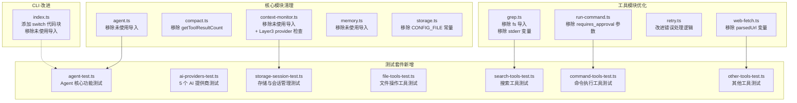

## 1. 高层摘要（TL;DR）

- **影响范围**: 中等 - 涉及核心模块清理、工具优化和全面的测试套件添加
- **主要变更**:
  - 🧹 清理了多个模块中未使用的导入和变量
  - 🔧 改进了错误处理逻辑和代码健壮性
  - ✨ 添加了 7 个完整的测试套件，覆盖核心功能
  - 🛡️ 为 Layer 3 压缩添加了 provider 空值检查
  - ⚠️ 移除了 `RunCommandTool` 的 `requires_approval` 参数

## 2. 可视化概览（代码与逻辑映射）



## 3. 详细变更分析

### 📦 核心模块清理（src/core/）

#### **agent.ts**
- **变更内容**: 移除未使用的导入
  - 删除 `path` 模块导入
  - 删除 `ToolResult` 类型导入
  - 删除 `estimateTokens` 函数导入
  - 删除 `shouldTriggerToolResultCleanup` 函数导入
  - 删除 `shouldTriggerLayer2Compact` 和 `shouldTriggerLayer3Compact` 函数导入
- **影响**: 减少了不必要的依赖，提高代码可维护性

#### **context-monitor.ts**
- **变更内容**: 
  - 移除未使用的导入（`shouldTriggerToolResultCleanup`, `CompactResult`, `shouldTriggerLayer2Compact`, `shouldTriggerLayer3Compact`, `MemoryExtractionResult`, `Layer3Result`）
  - **重要**: 为 Layer 3 压缩添加了 provider 空值检查
- **代码片段**:
```typescript
case 3:
  if (!provider) {
    result = {
      triggered: false,
      layer: 0,
      tokensBefore,
      tokensAfter: tokensBefore,
      tokensSaved: 0,
      reason: 'Layer 3 requires AI provider',
      messages,
    };
  } else {
    result = await this.executeLayer3(messages, provider);
  }
  break;
```
- **影响**: 防止在没有 AI provider 时执行 Layer 3 压缩导致的运行时错误

#### **compact.ts, memory.ts, storage.ts**
- **变更内容**: 移除未使用的导入和常量
- **影响**: 代码更简洁，减少维护负担

### 🛠️ 工具模块优化（src/tools/ & src/utils/）

#### **run-command.ts** ⚠️
- **变更内容**: 移除 `requires_approval` 参数
  - 从工具定义中删除该参数
  - 从必需参数列表中移除
  - 从执行逻辑中移除相关代码
- **影响**: 
  - **破坏性变更**: 命令执行不再需要用户审批
  - 简化了工具调用流程

#### **retry.ts**
- **变更内容**: 改进错误处理逻辑
  - 重构错误实例化逻辑，提高代码可读性
  - 提取 `shouldRetry` 变量，使逻辑更清晰
  - 使用 `??` 操作符替代 `||`，更准确的空值处理
- **代码片段**:
```typescript
const errorInstance = error instanceof Error ? error : new Error(String(error));
lastError = errorInstance;

const shouldRetry = isNetworkError || isAbortError || opts.retryOn.some(code => errorInstance.message.includes(String(code)));

if (attempt < opts.maxRetries && shouldRetry) {
  // ...
}

throw errorInstance;
throw lastError ?? new Error('Max retries exceeded');
```
- **影响**: 更健壮的错误处理，更好的代码可读性

#### **grep.ts, ls.ts, read.ts, web-fetch.ts**
- **变更内容**: 移除未使用的导入和变量
- **影响**: 代码更简洁

### 🖥️ CLI 模块改进（src/cli/index.ts）

- **变更内容**:
  - 移除未使用的导入（`formatMemoryForDisplay`, `extractSessionMemory`）
  - 为多个 switch case 添加代码块（`history`, `context`, `list`, `switch`, `title`, `default`）
  - 将未使用的变量 `i` 改为 `_i`（表示有意未使用）
- **影响**: 
  - 符合 ESLint 规则
  - 防止变量作用域泄漏

### ✨ 测试套件新增（tests/）

#### **新增测试文件概览**

| 测试文件 | 测试内容 | 测试场景数 |
|---------|---------|-----------|
| **agent-test.ts** | Agent 初始化、工具定义、消息处理、流式响应 | 4 个测试组 |
| **ai-providers-test.ts** | OpenAI, DeepSeek, Zhipu, Qwen, Kimi 提供商 | 5 个提供商 × 5 个测试 |
| **command-tools-test.ts** | RunCommand, CheckCommandStatus, StopCommand | 5 个测试组 |
| **file-tools-test.ts** | Read, Write, Edit 工具 | 4 个测试组 |
| **other-tools-test.ts** | GetTime, TodoManager, WebFetch, WebSearch | 6 个测试组 |
| **search-tools-test.ts** | Glob, Grep, LS 工具 | 4 个测试组 |
| **storage-session-test.ts** | Storage 和 SessionManager | 7 个测试组 |

#### **测试覆盖范围**
- ✅ 单元测试（工具、存储、会话管理）
- ✅ 集成测试（Agent 与 Provider 交互）
- ✅ 错误处理测试（无效输入、网络错误）
- ✅ 边界条件测试（空值、空数组、不存在的资源）

## 4. 影响与风险评估

### ⚠️ 破坏性变更

| 变更项 | 影响范围 | 建议 |
|-------|---------|------|
| **RunCommandTool 移除 `requires_approval` 参数** | 所有调用该工具的代码 | 更新工具调用，移除该参数 |
| **Layer 3 压缩需要 AI provider** | 使用 Layer 3 压缩的场景 | 确保 provider 不为 null |

### 🔍 测试建议

#### **高优先级测试**
1. ✅ **验证 RunCommandTool 不再需要 `requires_approval` 参数**
   ```typescript
   // 应该成功执行
   await runCommandTool.execute({
     command: 'echo test',
     blocking: true,
     // requires_approval: false  // 不再需要
   });
   ```

2. ✅ **验证 Layer 3 压缩在没有 provider 时的行为**
   ```typescript
   // 应该返回未触发状态
   const result = await contextMonitor.checkAndCompact(messages, null);
   expect(result.triggered).toBe(false);
   expect(result.reason).toBe('Layer 3 requires AI provider');
   ```

3. ✅ **验证 retry 逻辑的健壮性**
   - 测试网络错误重试
   - 测试 AbortError 处理
   - 测试最大重试次数后的行为

#### **中等优先级测试**
4. ✅ **运行所有新增的测试套件**
   ```bash
   npm run test:agent
   npm run test:ai-providers
   npm run test:command-tools
   npm run test:file-tools
   npm run test:other-tools
   npm run test:search-tools
   npm run test:storage-session
   ```

5. ✅ **验证未使用导入移除后功能正常**
   - Agent 初始化
   - 工具调用
   - 会话管理

### 📊 变更统计

| 类别 | 文件数 | 变更行数 |
|------|--------|---------|
| 核心模块清理 | 5 | ~30 行 |
| 工具模块优化 | 5 | ~40 行 |
| CLI 改进 | 1 | ~20 行 |
| 测试套件新增 | 7 | ~3200 行 |
| **总计** | **18** | **~3290 行** |

### 🎯 总体评估

这次变更主要是代码质量改进和测试基础设施的完善：

- ✅ **正面影响**: 
  - 代码更简洁、可维护性更高
  - 错误处理更健壮
  - 测试覆盖率大幅提升
  - 防止了潜在的运行时错误

- ⚠️ **需要注意**:
  - `RunCommandTool` 的参数变更可能影响现有调用
  - 需要确保所有测试通过

- 📈 **建议**:
  - 在合并前运行完整的测试套件
  - 更新相关文档以反映 API 变更
  - 考虑添加 CI/CD 自动化测试