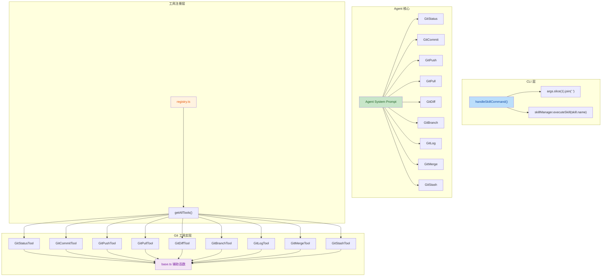

## 1. 高层摘要（TL;DR）

*   **影响范围：** 🟡 **中等** - 新增完整的 Git 工具集，修复 Skill 命令解析问题
*   **核心变更：**
    *   ✨ 新增 9 个 Git 工具（Status、Commit、Push、Pull、Diff、Branch、Log、Merge、Stash）
    *   🐛 修复 Skill 命令无法正确处理带空格名称的问题
    *   🧹 清理未使用的代码和导入
    *   📦 添加 `simple-git` 依赖

---

## 2. 可视化概览（代码与逻辑映射）



---

## 3. 详细变更分析

### 📦 依赖管理

**文件：** `package.json`

| 包名 | 旧版本 | 新版本 | 说明 |
|------|--------|--------|------|
| simple-git | - | ^3.22.0 | ✨ 新增 Git 操作依赖 |

同时重新排序了依赖项，使列表更整洁。

---

### 🐛 CLI 层 - Skill 命令修复

**文件：** `src/cli/index.ts`

**问题：** 原代码无法正确处理带空格的 Skill 名称，且执行时使用了错误的变量。

**修复内容：**

1. **Skill 名称解析修复**
   ```typescript
   // 修复前
   const skillName = args[1];
   
   // 修复后
   const skillName = args.slice(1).join(' ');
   ```
   - 支持如 `/skill run my complex skill` 这样的命令

2. **Skill 执行修复**
   ```typescript
   // 修复前
   const result = await skillManager.executeSkill(skillName, variables);
   
   // 修复后
   const result = await skillManager.executeSkill(skill.name, variables);
   ```
   - 使用解析后的 `skill.name` 而非原始输入

3. **Skill 显示逻辑重构**
   - 增加了回退机制：当 `subCmd` 未匹配时，尝试使用完整参数 `args.join(' ')` 匹配
   - 优化了代码结构，避免重复的显示逻辑

---

### 🤖 Agent 核心 - Git 工具集成

**文件：** `src/core/agent.ts`

在 Agent 的系统提示词中添加了 9 个 Git 工具的描述：

| 工具名称 | 功能描述 |
|----------|----------|
| GitStatus | 显示 Git 仓库当前状态 |
| GitCommit | 创建新的 Git 提交 |
| GitPush | 推送当前分支到远程仓库 |
| GitPull | 从远程仓库拉取变更 |
| GitDiff | 显示提交或工作树文件之间的变更 |
| GitBranch | 列出、创建、重命名或删除分支 |
| GitLog | 显示提交历史 |
| GitMerge | 合并分支到当前分支 |
| GitStash | 暂存未提交的变更 |

---

### 🧹 代码清理

**文件：** `src/core/skills/skill-parser.ts`

移除了未使用的导入和变量：

| 项目 | 类型 | 原因 |
|------|------|------|
| `SkillTrigger` | 导入 | 未在代码中使用 |
| `currentStepIndex` | 变量 | 未使用的变量 |

---

### 🔧 Git 工具实现

#### 基础设施（新文件）

**文件：** `src/tools/git/base.ts`

提供了 Git 工具的核心基础设施：

```typescript
// 核心类型定义
interface ParsedStatus {
  current: string | null;
  tracking: string | null;
  staged: string[];
  modified: string[];
  deleted: string[];
  untracked: string[];
  ahead: number;
  behind: number;
  isClean: boolean;
}

// 核心函数
- formatStatus(status): 格式化 Git 状态输出
- runGitCommand(command, cwd): 执行 Git 命令
- runGitCommandSafe(command, cwd): 安全执行 Git 命令
- getToolDefinition(...): 生成工具定义
```

#### Git 工具类（新文件）

所有 Git 工具都继承自 `BaseTool`，使用统一的错误处理和参数验证机制。

| 文件 | 工具类 | 主要功能 | 关键参数 |
|------|--------|----------|----------|
| `git-status.ts` | `GitStatusTool` | 显示仓库状态 | `cwd` |
| `git-commit.ts` | `GitCommitTool` | 创建提交 | `message` (必填), `amend` |
| `git-push.ts` | `GitPushTool` | 推送到远程 | `remote`, `branch`, `force` |
| `git-pull.ts` | `GitPullTool` | 从远程拉取 | `remote`, `branch` |
| `git-diff.ts` | `GitDiffTool` | 查看差异 | `file`, `cached` |
| `git-branch.ts` | `GitBranchTool` | 分支管理 | `action` (list/create/rename/delete), `name`, `newName`, `deleteBranch` |
| `git-log.ts` | `GitLogTool` | 查看历史 | `n` (数量), `file` |
| `git-merge.ts` | `GitMergeTool` | 合并分支 | `branch` (必填), `noFastForward`, `squash` |
| `git-stash.ts` | `GitStashTool` | 暂存管理 | `action` (save/pop/list/drop/show/apply/clear), `message`, `stashRef` |

**示例：GitBranchTool 的 action 参数**

```typescript
enum GitBranchAction {
  LIST = 'list',      // 列出所有分支
  CREATE = 'create',  // 创建新分支
  RENAME = 'rename',  // 重命名分支
  DELETE = 'delete'   // 删除分支
}
```

#### 工具注册

**文件：** `src/tools/index.ts` 和 `src/tools/registry.ts`

```typescript
// 导出所有 Git 工具
export { GitStatusTool } from './git/git-status';
export { GitCommitTool } from './git/git-commit';
// ... 其他 7 个工具

// 注册到工具列表
export function getAllTools(): Tool[] {
  return [
    // ... 现有工具
    new GitStatusTool(),
    new GitCommitTool(),
    new GitPushTool(),
    new GitPullTool(),
    new GitDiffTool(),
    new GitBranchTool(),
    new GitLogTool(),
    new GitMergeTool(),
    new GitStashTool(),
  ];
}
```

---

## 4. 影响与风险评估

### ✅ 向后兼容性

*   **无破坏性变更** - 所有新增功能都是扩展性的
*   **修复行为** - Skill 命令的修复改变了行为，但修复了原有 bug

### ⚠️ 潜在风险

| 风险项 | 级别 | 说明 | 缓解措施 |
|--------|------|------|----------|
| Git 命令执行 | 🟡 中等 | 直接执行 Git 命令可能受系统环境影响 | 使用 `cwd` 参数指定工作目录，添加错误处理 |
| Force Push | 🔴 高 | `GitPushTool` 支持 `force` 参数 | 在描述中明确警告风险 |
| Skill 名称变更 | 🟢 低 | Skill 命令解析逻辑变更 | 测试带空格的 Skill 名称 |

### 🧪 测试建议

1. **Skill 命令测试**
   - ✅ 测试 `/skill run simple-name`
   - ✅ 测试 `/skill run complex skill name`
   - ✅ 测试 `/skill complex skill name`（显示信息）

2. **Git 工具测试**
   - ✅ 测试 `GitStatus` 在不同状态（干净、有修改、有暂存）
   - ✅ 测试 `GitCommit` 创建提交和 amend
   - ✅ 测试 `GitBranch` 的所有 action（list/create/rename/delete）
   - ✅ 测试 `GitStash` 的 save/pop/list/drop/show/apply/clear
   - ✅ 测试 `GitDiff` 的 `cached` 参数
   - ✅ 测试 `GitMerge` 的 `noFastForward` 和 `squash` 参数

3. **错误处理测试**
   - ✅ 测试在非 Git 仓库中执行 Git 命令
   - ✅ 测试缺少必填参数时的错误提示
   - ✅ 测试 Git 命令失败时的错误信息

---

## 5. 总结

本次变更显著增强了 Agent 的版本控制能力，新增了完整的 Git 工具集，使其能够执行常见的 Git 操作。同时修复了 Skill 命令处理中的关键 bug，提升了用户体验。代码质量方面进行了清理，移除了未使用的代码。整体变更设计合理，风险可控。