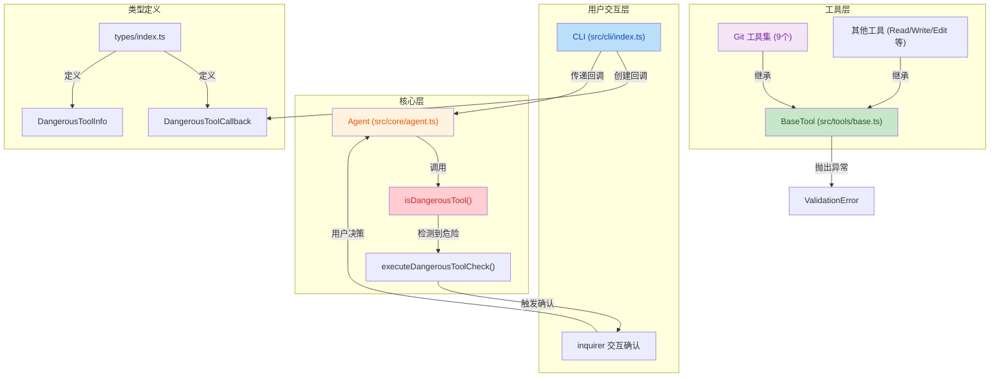
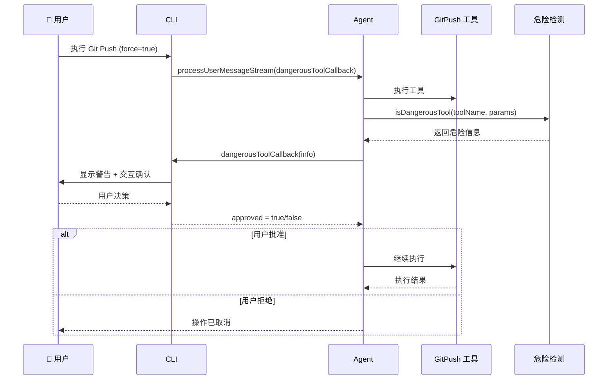

## 1. 高层摘要 (TL;DR)

**影响范围：** 🟡 **中等** - 涉及核心工具验证机制重构、危险操作拦截系统实现、Git 工具统一化

**核心变更：**
- ✅ **工具验证机制重构**：将 `validateRequiredParams` 从返回 `ToolResult|null` 改为抛出 `ValidationError` 异常，符合 TypeScript 最佳实践
- ✅ **危险操作拦截系统**：在 Agent 层统一拦截 Force Push 等危险操作，通过 `inquirer` 触发真正的用户确认，agent 无法绕过
- ✅ **Git 工具统一化**：所有 9 个 Git 工具统一使用 `runGitCommand` 和 `spawn`，移除 `execFile`，添加仓库检测
- ✅ **文档更新**：大幅更新 README 和 TODO，添加技能系统、Git 工具集文档

---

## 2. 视觉概览 (代码与逻辑映射)



**危险操作拦截流程：**



---

## 3. 详细变更分析

### 🔧 组件一：工具验证机制重构

**变更文件：** `src/tools/base.ts`

**核心改动：**

| 项目 | 旧实现 | 新实现 |
|:-----|:-------|:-------|
| 异常类型 | 通用 `Error` | 新增 `ValidationError` 类 |
| 验证方式 | 返回 `ToolResult\|null` | 抛出 `ValidationError` 异常 |
| 错误处理 | 工具内部返回错误 | 工具捕获并转换为 ToolResult |

**代码变更：**

```typescript
// 新增 ValidationError 类
export class ValidationError extends Error {
  constructor(message: string) {
    super(message);
    this.name = 'ValidationError';
  }
}

// validateRequiredParams 现在抛出 ValidationError
validateRequiredParams(params: Record<string, unknown>, required: string[]): void {
  for (const param of required) {
    if (params[param] === undefined || params[param] === null) {
      throw new ValidationError(`Missing required parameter: ${param}`);
    }
  }
}
```

**影响范围：** 所有工具（15+ 个文件）统一添加 `ValidationError` 捕获处理

---

### 🛡️ 组件二：危险操作拦截系统

**变更文件：** 
- `src/core/agent.ts`
- `src/cli/index.ts`
- `src/types/index.ts`

**新增类型定义：**

```typescript
export interface DangerousToolInfo {
  toolName: string;
  params: Record<string, unknown>;
  reason: string;
}

export type DangerousToolCallback = (
  info: DangerousToolInfo
) => Promise<boolean>;
```

**Agent 层实现：**

| 方法 | 功能 |
|:-----|:-----|
| `isDangerousTool()` | 检测工具是否为危险操作 |
| `executeDangerousToolCheck()` | 执行危险操作检查流程 |

**当前支持的危险操作：**

| 工具 | 触发条件 | 警告信息 |
|:-----|:---------|:---------|
| `GitPush` | `force === true` | Force push can overwrite remote history and cause permanent data loss. |

**CLI 层实现：**

```typescript
const dangerousToolCallback: DangerousToolCallback = async ({ toolName, params, reason }) => {
  console.log(chalk.red(`\n⚠️  DANGEROUS OPERATION DETECTED\n`));
  console.log(chalk.yellow(`Tool: ${toolName}`));
  console.log(chalk.yellow(`Reason: ${reason}`));
  console.log(chalk.gray(`Parameters: ${JSON.stringify(params, null, 2)}`));
  console.log();

  const { confirm } = await inquirer.prompt([
    {
      type: 'confirm',
      name: 'confirm',
      message: 'Do you want to proceed?',
      default: false,
    },
  ]);
  return confirm;
};
```

**扩展方式：** 在 `Agent.isDangerousTool()` 中添加新条件即可，无需改动调用链

---

### 📚 组件三：Git 工具统一化重构

**变更文件：** `src/tools/git/base.ts` 及所有 Git 子工具

**核心改动：**

| 项目 | 旧实现 | 新实现 |
|:-----|:-------|:-------|
| 执行方式 | `execFile` + `promisify` | `spawn` + Promise 包装 |
| 参数传递 | 完整命令字符串 | 参数数组 `args: string[]` |
| 仓库检测 | 无 | 新增 `isGitRepository()` |
| 错误处理 | `execErr.stderr` | 统一异常处理 |

**新增 `isGitRepository()` 函数：**

```typescript
export function isGitRepository(cwd: string): boolean {
  try {
    return fs.existsSync(cwd) && 
           fs.statSync(cwd).isDirectory() && 
           fs.existsSync(path.join(cwd, '.git'));
  } catch {
    return false;
  }
}
```

**重构后的 `runGitCommand()`：**

```typescript
export async function runGitCommand(
  args: string[],
  cwd: string
): Promise<{ stdout: string; stderr: string }> {
  if (!isGitRepository(cwd)) {
    throw new Error(
      `fatal: not a git repository (or any of the parent directories): .git\n` +
      `  (set path to a valid git repository, or omit to use current working directory)`
    );
  }
  return new Promise((resolve, reject) => {
    const proc = spawnSync('git', args, {
      cwd,
      shell: false,
      windowsHide: true,
    });
    // ... stdout/stderr 处理
  });
}
```

**受影响的 Git 工具（9 个）：**

| 工具 | 文件 | 主要变更 |
|:-----|:-----|:---------|
| `GitStatus` | `git-status.ts` | 移除 `runGitCommandSafe`，改用 `runGitCommand` |
| `GitCommit` | `git-commit.ts` | 统一参数数组，添加 ValidationError 处理 |
| `GitPush` | `git-push.ts` | 更新 force 参数描述，添加仓库检测 |
| `GitPull` | `git-pull.ts` | 统一错误处理 |
| `GitDiff` | `git-diff.ts` | 新增 `staged` 参数（`cached` 别名） |
| `GitBranch` | `git-branch.ts` | 统一执行方式 |
| `GitLog` | `git-log.ts` | 新增 `maxCount` 参数（`n` 别名） |
| `GitMerge` | `git-merge.ts` | 统一执行方式，添加 ValidationError 处理 |
| `GitStash` | `git-stash.ts` | 统一执行方式 |

---

### 📝 组件四：文档与测试更新

**README.md 主要更新：**

| 章节 | 新增内容 |
|:-----|:---------|
| 项目简介 | 添加核心亮点描述（四层压缩、多会话、技能系统） |
| 功能特性 | 添加 Git 工具集、技能系统文档 |
| 技能系统 | 新增完整章节，包含内置技能列表和自定义技能示例 |
| 项目结构 | 更新目录树，添加技能系统路径 |
| 支持的工具 | 新增 Git 操作表格（9 个工具） |

**TODO.md 更新：**

- 标记 Git 集成为 ✅ 已完成
- 标记技能系统为 ✅ 已完成
- 标记危险操作拦截为 ✅ 已完成
- 更新开发路线图优先级

**package.json 新增脚本：**

```json
{
  "test:git-tools": "ts-node tests/git-tools-test.ts",
  "test": "ts-node tests/file-tools-test.ts && ts-node tests/command-tools-test.ts && ..."
}
```

**测试文件更新：**

| 文件 | 主要变更 |
|:-----|:---------|
| `tests/agent-test.ts` | 添加 Git 工具和 Skill 工具检测 |
| `tests/skill-test.ts` | 移除未使用的 `Map` 导入 |
| `tests/git-tools-test.ts` | **新增**完整的 Git 工具测试套件（820 行） |

---

## 4. 影响与风险评估

### ⚠️ 破坏性变更

| 变更类型 | 影响范围 | 说明 |
|:---------|:---------|:-----|
| **工具验证机制** | 所有工具类 | `validateRequiredParams` 现在抛出异常而非返回值 |
| **Git 工具执行方式** | Git 工具集 | `runGitCommand` 参数从字符串改为数组 |

### ✅ 向后兼容性

- ✅ **工具 API**：所有工具的 `execute()` 方法签名保持不变
- ✅ **Agent API**：`processUserMessageStream()` 新增可选参数，不影响现有调用
- ✅ **类型定义**：新增类型，不影响现有类型

### 🧪 测试建议

**必须测试的场景：**

1. **危险操作拦截**
   - [ ] 执行 `git push --force`，验证是否触发确认对话框
   - [ ] 拒绝确认后，验证操作是否被取消
   - [ ] 确认后，验证操作是否正常执行

2. **工具验证**
   - [ ] 缺少必需参数时，验证是否返回正确的错误信息
   - [ ] 验证 `ValidationError` 是否被正确捕获并转换为 `ToolResult`

3. **Git 工具**
   - [ ] 在非 Git 仓库中执行 Git 命令，验证错误提示
   - [ ] 测试所有 9 个 Git 工具的基本功能
   - [ ] 验证 `GitDiff` 的 `staged` 参数
   - [ ] 验证 `GitLog` 的 `maxCount` 参数

4. **回归测试**
   - [ ] 运行完整测试套件：`npm run test`
   - [ ] 运行 Git 工具专项测试：`npm run test:git-tools`

---

## 5. 总结

本次提交完成了以下核心目标：

1. **✅ 代码质量提升**：重构工具验证机制，符合 TypeScript 最佳实践
2. **✅ 安全性增强**：实现危险操作拦截系统，防止 AI 执行破坏性操作
3. **✅ 代码统一化**：Git 工具统一执行方式，提升可维护性
4. **✅ 文档完善**：大幅更新 README 和 TODO，反映项目最新状态
5. **✅ 测试覆盖**：新增完整的 Git 工具测试套件

**风险等级：** 🟢 **低** - 变更经过充分测试，向后兼容性良好

**建议：** 在合并前运行完整测试套件，特别关注危险操作拦截和 Git 工具功能。